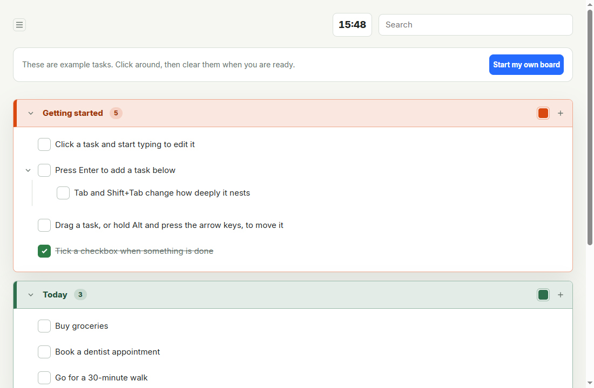

# Punchlist

A day planner that lives in one HTML file. No account, no server, no install, no network requests. Nested outline, day timeline, focus timing, and Markdown export, all offline.

### Website: https://evrenucar.github.io/punchlist_app/

Start here. The landing page explains what Punchlist is and runs the real app as a live demo you can type into.

Secondary links: [open the app directly](https://evrenucar.github.io/punchlist_app/task-board.html) and [build notes](https://evrenucar.github.io/punchlist_app/notes.html).



## What it is

The whole app is one 340 KB HTML file you can open straight from disk. Tasks save to your browser and export losslessly to JSON or clean Markdown. Nothing leaves the machine unless you turn on GitHub sync. The name is a construction term: the punch list is the last set of fixes before a building is handed over, worked down to zero. (The repository name predates the Punchlist branding.)

## Run it

- **Hosted:** open the [live app](https://evrenucar.github.io/punchlist_app/task-board.html); it runs at that URL and saves to that browser's local storage.
- **Local:** download [`outputs/task-board.html`](outputs/task-board.html) and open it from disk, offline, zero requests, even if the site disappears.
- **Share across devices:** point your phone and laptop at one private GitHub repo under Settings → Sync; every change lands there as a commit.

Different browsers do not share storage. Use JSON export for a lossless backup and Markdown for portable outlines.

## Features

- Nested outline editing with keyboard commands, multi-select, undo, and mouse or long-press touch drag.
- Markdown clipboard: copy tasks as clean indented Markdown, paste external Markdown as new tasks, and paste internally as aliases, references, or duplicates.
- Configurable lifecycle: completed tasks hide after a chosen duration into a Completed view, and deletes go to a restorable Trash by policy (`task > group > global` overrides available).
- Optional planning tools (off by default): per-task date, start time, planned minutes, reminders, a day Timeline with drag rescheduling, and planned-versus-actual focus comparison.
- Collapsible sidebar with Views/Groups navigation, phone drawer layout, light and dark themes, and a built-in Help panel.
- Optional GitHub sync (one JSON file in a private repo, local-wins conflicts backed by commit history), with named devices in history entries and commit messages.
- Signed board exports: each board signs exports with its own key, and importing one shows whether it came from a known sender, a first-time sender, or was modified after signing (design record in [`docs/IDENTITY.md`](docs/IDENTITY.md)).

## Development

Source files are authored in `src/` and inlined into the single distributable file by a zero-dependency build script:

- `src/task-board.html` - semantic application shell
- `src/task-board.css` - responsive light/dark presentation
- `src/task-board.js` - state, editor, scheduling, and persistence
- `scripts/build-task-board.mjs` - bundler that emits `outputs/task-board.html`
- `tests/task-board.static.test.mjs` - Node tests for state, lifecycle, scheduling, and output contract

Build and test with:

```powershell
node scripts/build-task-board.mjs
node --test tests/task-board.static.test.mjs
```

Never hand-edit `outputs/task-board.html`; change `src/` and rebuild.

## Website

`website/` holds a static landing page (`index.html`) plus a copy of the app that the build script refreshes on every build. Deploy the folder as-is to any static host. To collect emails server-side, set `FORM_ENDPOINT` near the bottom of `index.html` to a form service URL; until then the form falls back to a prefilled email draft.

## Product rules

- JSON is canonical and lossless; Markdown is clean interchange.
- Stable task IDs never encode mutable group or parent placement.
- The default interface is a minimal outline. Advanced capabilities stay absent until enabled in Settings.
- Day Plan is an ordinary group by default. Timeline is an optional view of the same tasks.
- Delete is configurable, but safe defaults preserve restorable records in Trash.
- Existing locally saved boards must migrate without losing text, hierarchy, completion, colors, or focus time.
- Desktop keyboard workflows and phone touch workflows are equal requirements.

See [`docs/AGENT_HANDOFF.md`](docs/AGENT_HANDOFF.md) for implementation context, [`docs/DIRECTIONS.md`](docs/DIRECTIONS.md) for the current priority and next-direction plan, and [`docs/ROADMAP.md`](docs/ROADMAP.md) for prioritized work.
