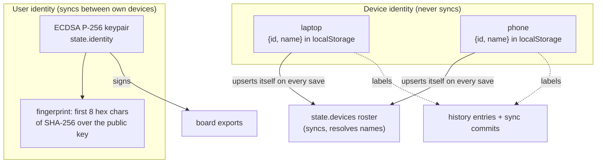
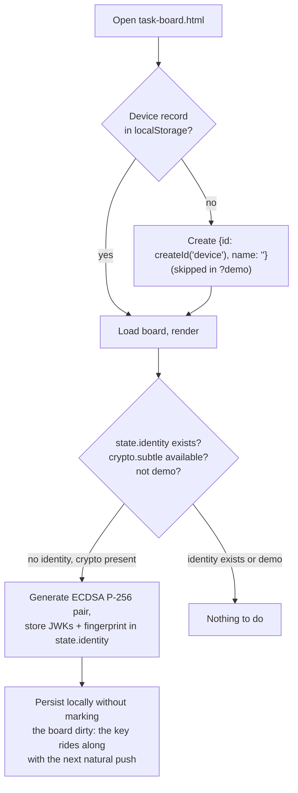
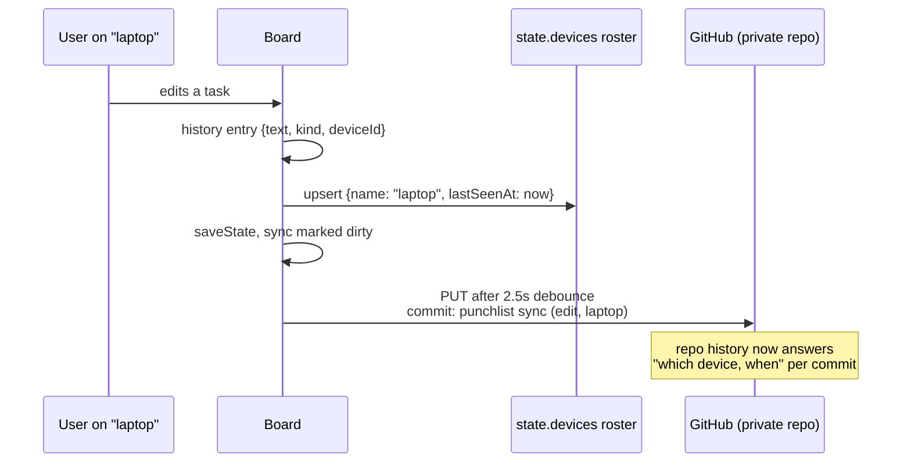
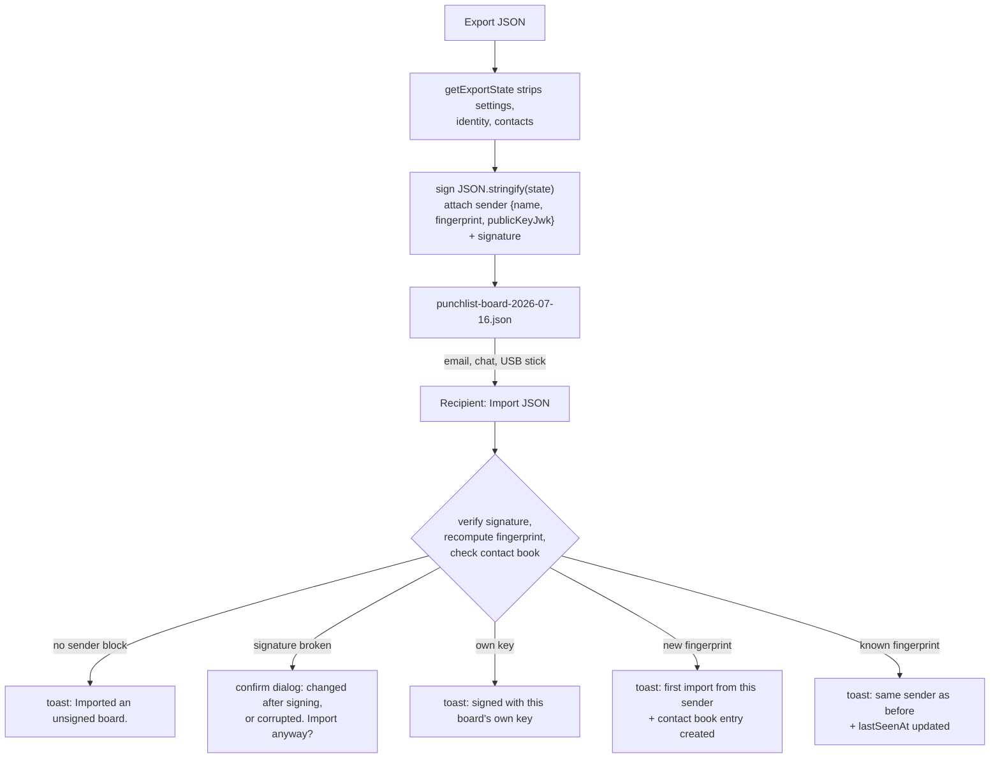

# Identity: devices, signing keys, and shared exports

Shipped in v1.3.0 (2026-07-16). This document records the design discussion that produced it, what each piece proves, and where identity touches the app's flows. Evren asked for two things during the grill session: know which of his devices made each change, and let someone who imports his exported board confirm it came from the same sender as the previous one. He first proposed a hashed username stored secretly. The discussion below explains why the shipped design uses a plain device label plus one signing keypair instead.

## Goals and non-goals

The build covers exactly two guarantees:

1. **Device forensics for the board owner.** Every history entry, sync commit, and roster row names the device that wrote it.
2. **Sender continuity for recipients.** A signed export carries a public key; whoever imports two of them can tell both came from the same key holder, or didn't.

Not in scope, on purpose: proving a legal identity ("this is the human Evren"), signing individual history entries, sharing or collaborating on subtrees, key rotation, and encrypting the board at rest. The sharing and collaboration vision stays parked in `ROADMAP.md` under "Deferred vision"; this build only lays the identity groundwork it will need.

## Why not a hash, and why nothing is "stored secretly" except the key

A hash cannot prove origin. Anyone can compute SHA-256 over the same bytes and get the same result, so a hash on an export proves only that the file wasn't corrupted, not who made it. Proof of origin needs an asymmetric signature: a private key signs, the matching public key verifies, and only the key holder can produce a signature that verifies.

That private key is the one secret in the design, and it stays inside the user's own storage surfaces: `localStorage` on each device and the private sync repo. Two storage ideas from the discussion died on contact with facts:

- **GitHub Actions secrets** are injected into workflow runs on GitHub's servers. A static page running in a browser has no way to read them, so they cannot hold anything this app needs at runtime.
- **Hashing the username per device** produces the same value on every device that has the same username, so it cannot distinguish devices. A random id can, and needs no derivation scheme.

The device id therefore carries no secrecy at all. It is a label, like a hostname. Knowing it grants nothing.

## The two-layer model



One keypair per user, not per device. The keypair lives in board state, and board state syncs through the user's private repo, so every device the user connects ends up signing with the same key. Per-device keypairs were considered and rejected: a recipient would see "same user, new device" as a stranger, and fixing that requires the user key to certify device keys, which is a certificate chain. Two guarantees did not justify one.

Devices stay below the key: each one keeps `{ id, name }` in its own localStorage entry (`scheduling-task-management-board-v1-device`), writes itself into the synced `state.devices` roster on every save, and gets named in history entries and commit messages. The id comes from the existing `createId()` helper; nothing about it is hashed or hidden.

## What a signature proves, and what it does not

| Claim | Proven? | Why |
|---|---|---|
| This export was produced by the holder of this private key | Yes | ECDSA signature over the exported state verifies against the embedded public key |
| This export came from the same sender as the last one | Yes, after first contact | The recipient's contact book stores the key fingerprint from the first import (trust on first use, like SSH host keys) |
| The export was not modified after signing | Yes | Any byte change in `state` breaks verification; the suite's tamper test flips one group title and the verdict becomes `invalid` |
| The human Evren typed these tasks | No | A signature proves key possession. Anyone with access to the browser profile holds the key |
| The claimed sender name is real | No | `sender.name` is a self-chosen label. Only the fingerprint is checked, and it is recomputed from the embedded key, never read from the sender's claim |
| Device labels in history are authentic | Within the owner's own repo, yes | Sync commits are authenticated by the owner's PAT; forging a device tag requires write access to the repo, at which point tags are the smaller problem |

The pure decision core is `importTrustVerdict()` in `src/task-board.js`, five outcomes: `unsigned`, `invalid`, `self`, `known`, `first-contact`.

## Storage map

| Data | Lives in | Syncs? | In board exports? |
|---|---|---|---|
| Username (person's display name) | `state.settings.username` | No (settings never sync) | As `sender.name` on signed exports |
| Device `{id, name}` | localStorage `...-device` key | Never | No |
| Device roster `{id: {name, lastSeenAt}}` | `state.devices` | Yes | Yes; device attribution in shares is the point |
| Signing keypair + fingerprint | `state.identity` | Yes, via the private repo | **Private half never.** Public half and fingerprint ride in `sender` |
| Contact book `{fingerprint: {name, firstSeenAt, lastSeenAt}}` | `state.contacts` | Yes | Never; who you trade boards with is your business |
| GitHub token | localStorage `...-sync` key | Never | Never (unchanged from v1.2.0) |

The export stripping happens in `getExportState()`. That function spreads the whole state object, so every new state field is a leak until it is explicitly stripped; the test "exports carry a signature but never the private key or contact book" exists to catch the day someone forgets.

## Flows

### First app start



Identity creation is invisible. No dialog, no setup step. The only visible trace is the "Signing identity" line in Settings once the key exists, and the Device name field, which starts empty and works without GitHub or sync.

### An edit, from keystroke to commit



The history panel resolves `deviceId` through the roster and shows the device name in each entry's detail row. Entries written before v1.3.0 have no `deviceId` and render exactly as before.

### A second device joins

```mermaid
sequenceDiagram
    participant P as Phone (fresh)
    participant G as Private repo
    P->>P: creates its own device record "phone"
    P->>G: enables sync, pulls
    G->>P: board state incl. state.identity and roster
    Note over P: phone now signs with the same key<br/>as the laptop; one user, two devices
    P->>G: next edit pushes; roster gains "phone"
```

Edge case, handled in `createSigningIdentity()` and `applySyncedState()`: if both devices generate keys before the first sync meets them, the first pushed key wins and the other device adopts it on pull. A pull from a device running an older build cannot wipe the key; the local one is kept when the payload has none. Practical advice stands anyway: enable sync on the second device before sharing exports with anyone.

### Sharing an export, and what the recipient sees



The contact book syncs, so recognizing a sender on the laptop means the phone recognizes them too. The recipient's history entry also records the sender: "Imported a board from JSON, signed by Evren (a3f9c21b)".

## The same problem from four chairs

**Ponytail (what got cut).** The hash: replaced by `createId()`, one call. Secret storage for the device id: deleted, it's a label. Per-device keypairs and certificates: deleted, one user key covers both stated guarantees. IndexedDB with non-extractable keys: deferred with a `ponytail:` comment in the source; extractable JWKs in state are what lets the key sync at all, and the threat model that punishes extractability (someone with full access to your browser profile) already owns your board and your PAT. Total new identity machinery: about 120 lines including the verdict UI.

**Software architect (where the boundaries sit).** Three trust boundaries, each with an owner. Local device boundary: the `-device` and `-sync` localStorage keys never enter state, so they can never sync or export. Own-repo boundary: `getSyncPayload()` ships everything except settings, because every reader of the private repo is the same user; the PAT authenticates writes, which is why sync payloads carry no signature. Sharing boundary: `getExportState()` strips secrets and the signature is added on top. The one structural hazard is that `getExportState()` strips by exception ("spread everything, undefine the secrets"), so new secret-bearing state fields default to leaking. A regression test guards it; the alternative, allowlisting fields, was rejected because it silently drops new board data instead, and losing task data is the worse failure here.

**Product (why now, and why this much).** The success metric is unchanged: Punchlist as Evren's daily driver. Device tags serve that today, on his two devices. Signing serves the sharing future he keeps circling back to, and the expensive part of signing is not the crypto, it is the identity model; deciding "one key per user, TOFU for recipients" now means shared exports, shared groups, and linked boards later all inherit a settled answer. What was deliberately not built matches the roadmap's parked list: no accounts, no server, no stranger onboarding.

**UX (what the user actually sees).** Two new controls and both are optional. A "Device name" text field in Settings next to Username; empty is fine, it falls back to "device" plus the id's last four characters. A read-only "Signing identity" line showing name and fingerprint. Verdicts arrive as toasts in the same style as every other board message, worded as facts ("first import from this sender"), not warnings, because a first contact is normal, not scary. The single blocking interaction is the broken signature confirm, and it blocks because the file was modified after signing, which is the one case worth interrupting for. Naming a device is the only setup step anyone has to think about, and skipping it costs nothing but readability.

## Deferred, with the trigger that would unpark each

- **Per-entry signatures** (each history entry independently verifiable): needed only when multiple users write to one shared board. Parked with the collaboration vision.
- **Key rotation and revocation**: matters once strangers rely on a fingerprint. TOFU plus "tell the recipient out of band" covers the current audience of zero external recipients.
- **Non-extractable keys in IndexedDB**: upgrade path noted in the source; would end key sync via state and require a per-device key + certification design, so it waits for a threat model that demands it.
- **Public key publishing** (fingerprint on the GitHub Pages site, for out-of-band checks): one static line on the website, worth adding the day a second person imports an Evren export.
